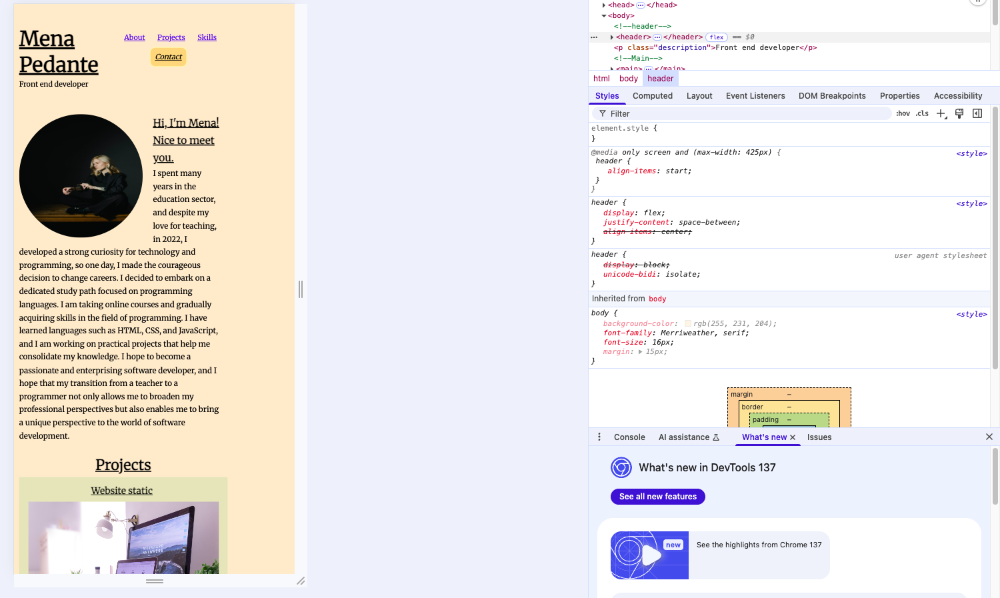

# Portfolio-project

Welcome to my portfolio project!

In this project, you’ll find:

-   **Two HTML files**. In `contact.html`, there's a small JavaScript snippet that links the two web pages and adds a bit of interaction. At the end of the page, you’ll find a **“New Encouragement”** button that displays different quotes when clicked.

-   **A CSS file** that contains all the styling rules.

-   **A folder with resources** used for styling the website.

The layout has been adapted to work across different screen sizes, including **desktop**, **tablet**, and **mobile** devices.

Feel free to explore the code and resources. If you have any questions or suggestions, don’t hesitate to reach out.  
Thanks for checking out my project!

## Screenshots

### Mobile View – Responsive version

The layout has been adapted for smaller screens like mobile devices.

