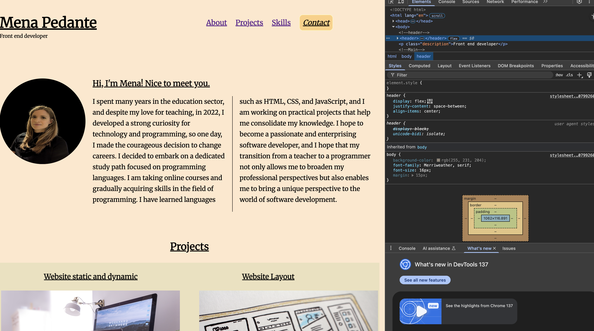

# Portfolio Project

Welcome to my portfolio project!

This project includes:

## 📄 HTML Files

**Two HTML files:**

-   `index.html` – Presents the main layout and structure of the site.
-   `contact.html` – Contains contact information and a small interactive element.

Each page is structured using `div` elements and semantic sections for clarity and accessibility.

## ✨ JavaScript Interaction

In `contact.html`, you'll find a **small JavaScript snippet** that adds basic interactivity:

-   A **"New Encouragement"** button at the bottom of the page displays a random motivational quote when clicked.

This demonstrates how even simple JavaScript can improve user experience in a static project.

## 🎨 Styling

-   **A CSS file** that defines all the styling rules.
-   **A folder with resources** (images and assets) used to style the website.

## 📱 Responsive Design

The layout has been adapted for various screen sizes, including **desktop**, **tablet**, and **mobile** devices.

## 🖼️ Screenshots

### Desktop View

### Mobile View

---

Feel free to explore the code and resources. If you have any questions or suggestions, don’t hesitate to reach out.  
**Thanks for checking out my project!**
